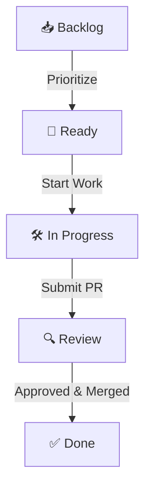

# PW-Core Project Management & Roadmap

This file documents the status legend, workflow, categories, goals, and contribution guidelines for the `PW-Core` project.

---

## Status Legend

| Status | Icon | Description |
| :--- | :---: | :--- |
| **Backlog** | 📥 | Issues that are verified and triaged but not yet prioritized for active development. |
| **Ready** | 🚀 | Tasks defined and approved, ready to be picked up by contributors. |
| **In Progress** | 🛠️ | Active development is underway. |
| **Review** | 🔍 | Code changes are complete and undergoing review or testing. |
| **Done** | ✅ | Task completed successfully and merged into the main branch. |

---

## Workflow

---

## Categories (Types)

- **Feature**: Introducing new functionality or APIs to the framework.
- **Bug**: Fixing regressions, type issues, or incorrect step mappings.
- **Enhancement**: Optimizing existing methods, steps, or performance.
- **Documentation**: Updating local docs, examples, or website guides.
- **Release**: Preparing artifacts, changelogs, and tags for npm releases.

---

## Current Goals

- **Goal 1**: Stabilize Playwright test step location reporting (ensure no internal `dist/` or `node_modules` paths in HTML reports).
- **Goal 2**: Enhance the custom Table components with flexible cell selection.
- **Goal 3**: Expand CLI capabilities for automatic test template generation.

---

## Contribution Guidelines

1. **Issue Triage**:
   - Every issue must use one of the templates (`bug_report`, `feature_request`, `enhancement`, etc.).
   - Issues should have an `Area`, `Type`, and `Priority` assigned.
2. **Branching**:
   - Feature branches should be named `feature/description` or `bug/description`.
3. **Pull Requests**:
   - Must reference the resolved issue (e.g. `Closes #123`).
   - Must pass all E2E and unit tests (`npm run test` in `examples`).
